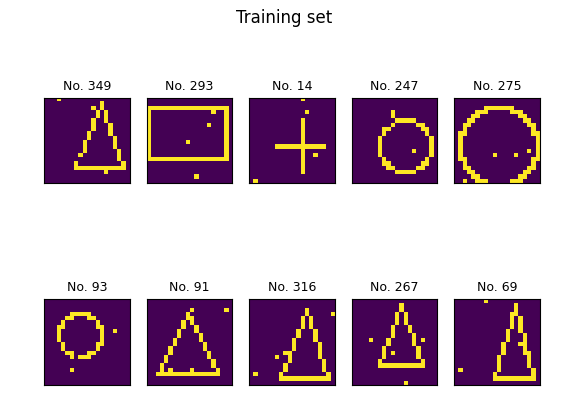

# Deep Neural Network Library

Using this library you can create deep neural networks of your choosing by defining config files. The networks only support dense layers, but accepts any number of network at any size. Weight regularization is also available as well as activation functions and loss function specification. The networks accept just about anything as input data.

## Data Set Generator

To test the neural networks, a data set generator was created. This generator creates images of a size (chosen in the config) with four possible shapes of random size and position: Triangle, Circle, Cross or Rectangle. There are also noise added to the image to futher challenge the neural network. This data can then be flattened and sent as input to the neural network.

## Usage

To run this program, download or clone the repository and run using Python 3.9 or higher.

### Download

Clone the project to any local directory. From there, the network class can be instantiated to create neural networks or the `test_images.py`-script can be run to test different neural networks on a generated data set.

## Requirements

- Python 3.9 or higher
- Numpy
- Matplotlib
- Bresenham (tested ver. 0.2.1)

`pip install numpy matplotlib bresenham`

## Configuration

Most settings can be changed in the config files. The global parameters concerns configuration for the data generator and the network, while the definition of individual layers in the network are defined in the layer-section.

The syntax of the neural network config files is identical to Windows'
.ini-files' syntax, where variables are defined on separate lines with an
equals-sign separating the variable and the value. Each layer in the network is defined as its own section.

### Sections

#### Globals

A config file consists of several sections, the first one being the 'GLOBALS'-
section. Here, parameters for the data generator, and general parameters for
the neural network are defined such as the number of epochs, input values,
whether to use Softmax or not and the loss function to be used.

#### Layers

Each section following the 'GLOBALS'-section is treated as a layer. The
section's actual name is not important, save for the fact that it must be
unique and different from all other section-labels. The layers are constructed
chronologically in the order they are encountered in the config file. This means
the first section following 'GLOBALS' is the first layer after the input layer.
In each layer, the number of inputs are implied from the number of input nodes
or from the number of outputs from the upstream layer. In each layer, one can
specify the number of nodes in that layer, its activation function, the range
for the initialization of the weights and biases and layer-specific learning
rate if this is desired.

## License

This code is protected under the [GNU General Public License 3.0](http://www.gnu.org/licenses/gpl-3.0.html)
